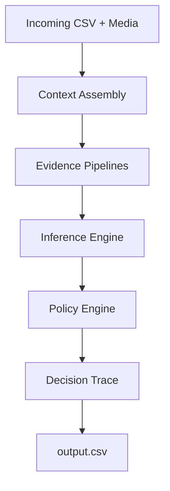

# EDNRA – Evidence-Driven Notification Reasoning Architecture

## Project Overview

EDNRA is an intelligent notification routing system developed for the HackerRank Orchestrate (August 2026) challenge. The system is designed to solve the problem of WhatsApp notification fatigue by routing every incoming multimodal message into one of three distinct actions:

- **notify**: Interrupt the user immediately (high-priority or time-sensitive).
- **digest**: Hold the message for a later batch summary (medium-priority or promotional).
- **mute**: Suppress the message entirely (spam, scams, or unengaged sources).

Unlike opaque "black-box" AI pipelines, EDNRA places a heavy emphasis on **explainability**, **determinism**, and **personalization**. AI is strictly utilized for extracting semantic metadata, while routing decisions are enforced by a transparent, traceable rules engine operating over hard evidence.

## Architecture Overview

EDNRA operates through a strict data flow. State is incrementally enriched across the pipeline, ensuring that the final output is directly traceable back to historical and semantic evidence.



## Core Components

The core architecture resides inside the `code/` directory, divided into functional, decoupled modules:

- **`context`**: Responsible for loading the raw dataset (CSV files, user profiles, historical logs, media metadata) and parsing it into structured Python DataClasses. This forms the single source of truth for the session.
- **`pipelines`**: A collection of `EvidencePipeline` subclasses that gather localized evidence without making final routing decisions. They calculate scam risk, analyze sender trust, check user DND schedules, and scan media metadata.
- **`inference`**: Consolidates all evidence into an `InferenceEngine` and manages integration with local LLMs (via `llm_classifier.py`). The inference layer only generates states, not actions.
- **`policy`**: Contains the deterministic `PolicyEngine`, which matches the inferred state against a tiered hierarchy of rules (Absolute Mutes → Absolute Notifies → Contextual Decisions). It also computes a transparent Decision Support Index (DSI) representing the mathematical strength of the evidence, which is explicitly clamped between a lower bound of `0.60` and an upper bound of `0.97`.
- **`output`**: Translates the decision into a faithful `ReasoningTrace` and handles formatting and file I/O for the HackerRank-compliant `output.csv`.
- **`evaluation`**: A robust validation suite that checks output metrics, schema correctness, action distributions, and confidence bounds against HackerRank's expectations.
- **`tests`**: Contains `pytest` suites to execute the evaluation logic and validate internal components.

## AI Usage

In EDNRA, Artificial Intelligence is utilized as an **extractor**, not a decision-maker.

- **Model Agnostic**: EDNRA is entirely model-agnostic. Any LLM capable of structured JSON extraction can be plugged into the semantic analysis layer.
- **Implementation Detail**: During development, a locally hosted Ollama model was used as the semantic extraction backend to process unstructured message text and basic media descriptions, but this is an implementation choice rather than an architectural dependency.
- **Scope Limitation**: The LLM strictly performs semantic understanding. It only extracts structured information: `message_type` (e.g., transactional, promotion, personal) and a subjective `semantic_urgency` score. 
- **Determinism**: The AI does *not* make routing decisions (notify, digest, mute). Those decisions are handled entirely by the deterministic Policy Engine.
- **Explainability**: Our explainability stems from logging the exact evidence bundles, user history IDs, and fired policies. We do not rely on LLM hallucinations for explanations.

## Decision Process

The EDNRA workflow is built to guarantee full auditability:

1. **Evidence Collection**: Gather hard signals (historical metrics, group membership, whitelists, API verification).
2. **Inference**: Merge hard signals with soft signals (LLM semantic classification) to build an `InferredMessageState`.
3. **Policy Evaluation**: The deterministic Policy Engine cascades through rules until a match is found based on the combined evidence bundle.
4. **Decision Generation**: A decision (`notify`/`digest`/`mute`) is emitted alongside a calculated Decision Support Index (DSI).
5. **Trace Generation**: The `TraceBuilder` formats the outcome into a final, faithful reasoning trace without inventing facts.

Every routing decision made by EDNRA is 100% traceable and reproducible.

## Running the Project

To execute the full EDNRA pipeline over the provided dataset, run:

```bash
PYTHONPATH=$PYTHONPATH:$(pwd)/code python3 code/main.py
```

This will generate a compliant results file directly to:
`dataset/output.csv`

## Evaluation

To ensure pipeline stability and guarantee the final schema is correct, the system is bundled with a comprehensive test suite. 
Run the following to evaluate the generated output:

```bash
PYTHONPATH=$PYTHONPATH:$(pwd)/code pytest code/tests/test_evaluation.py -v
```

The evaluation suite validates pipeline behavior, checks constraint boundaries, ensures evidence IDs exist in the historical data, and guards against hard-coded anomalies.

## Project Structure

```text
code/
├── context/
│   ├── __init__.py
│   ├── loader.py
│   └── models.py
├── evaluation/
│   ├── __init__.py
│   └── main.py
├── inference/
│   ├── __init__.py
│   ├── engine.py
│   ├── llm_classifier.py
│   └── states.py
├── main.py
├── output/
│   ├── __init__.py
│   ├── trace.py
│   ├── trace_builder.py
│   └── writer.py
├── pipelines/
│   ├── __init__.py
│   ├── base.py
│   ├── business_context.py
│   ├── content_signals.py
│   ├── group_context.py
│   ├── historical_match.py
│   ├── media_signals.py
│   ├── scam_risk.py
│   ├── sender_trust.py
│   └── user_behavior.py
├── policy/
│   ├── __init__.py
│   ├── dsi.py
│   ├── engine.py
│   └── models.py
└── tests/
    ├── __init__.py
    ├── helpers.py
    ├── test_evaluation.py
    ├── test_ollama.py
    └── test_trace.py
```

## Design Principles

EDNRA was architected following stringent principles:

- **Explainability**: Outputs must map directly back to a known policy and historical evidence ID.
- **Deterministic Reasoning**: No probabilistic routing logic. AI supports, but never decides.
- **Evidence-Driven Inference**: Fallbacks exist for LLM failures, relying purely on structural and historical facts.
- **Modular Architecture**: Independent evidence pipelines that don't leak state into one another.
- **Auditability**: Traces serve as immutable records of *why* a decision was made.

## Limitations

- **Tuning**: The deterministic policies rely on heuristic thresholds (e.g., historical mute rates, DND hours) which currently require manual adjustment.
- **Model Constraints**: The semantic extraction quality heavily depends on the chosen underlying LLM, and the system will fallback to basic regex matching if the model hallucinates or timeouts.
- **Over-fitting Risks**: While modular, some evidence pipelines are strongly optimized for the schema specific to this dataset, which limits true zero-shot routing without retraining or modifying context loaders.

## Future Work

Realistic improvements include:
- **Learned Policy Optimization**: Training a lightweight ranker or Decision Tree over user responses to adjust the policy thresholds automatically.
- **Confidence Calibration**: Better mathematical bounds on the DSI metric.
- **Multimodal VLM Support**: Feeding images directly to a VLM (e.g., LLaVA) rather than relying exclusively on simple OCR text/metadata fields.
- **Online User Preference Learning**: Incrementally updating the semantic urgency weights dynamically based on streaming feedback, replacing rigid static profiles.
